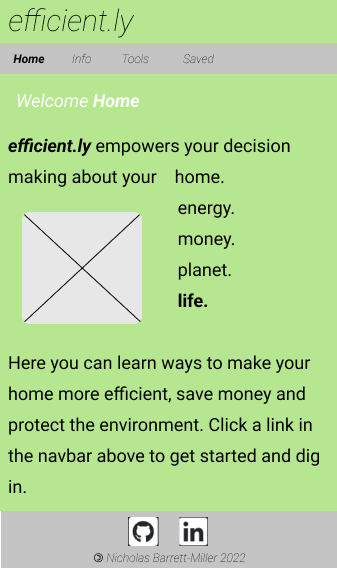
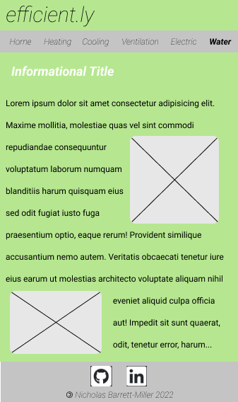
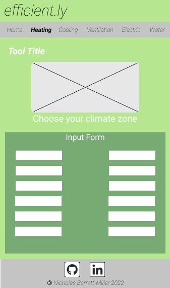
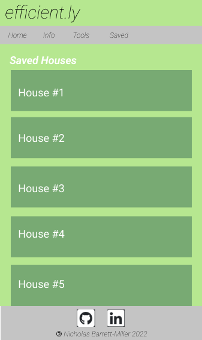
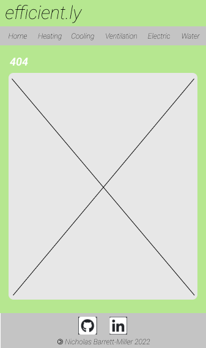
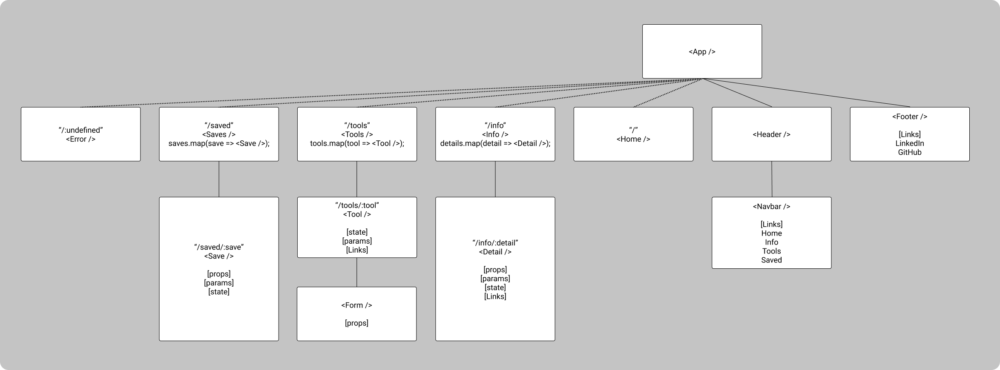

# **_efficient.ly_**

## Overview

**_efficient.ly_** is a [React](https://reactjs.org/) application that empowers users to make informed decisions about energy and resource usage in their homes. The site contains a plethora of information on ways to make their homes more efficient and therefore, save money and protect the environment.

## Wireframes
#### Homepage


#### Informational Page


#### Tool Page


#### Saved Page


#### 404 Error Page


###### [Wireframes created with Figma](https://www.figma.com/)

## Component Hierarchy

###### [Component hierarchy created with Figma](https://www.figma.com/)

## API and Data Sample

This project uses [Airtable](https://www.airtable.com/) as an API. The response data from Airtable returns an object with data specifying insulation and heating energy data for a house in a given U.S. climate zone:

```
{
    "id": "recuxb0JIB5JHgLcf",
    "fields": {
        "climateZone": 6,
        "wallThickness": 12,
        "wallRValue": 28,
        "btuPerHr": 9000,
        "sqrFeet": 1500
    },
    "createdTime": "2022-01-08T01:10:17.000Z"
}
```
###### Uses [React Router](https://reactrouter.com/docs/en/v6) for routes and [Axios](https://axios-http.com/docs/intro) for API requests.

## MVP/PostMVP
#### MVP
- Uses [Airtable](https://www.airtable.com/) base as API
- Contains pages on electrical, heating, cooling, water, and ventilation as they pertain to green building design
- Renders heating data to page, and based on user input sizes heating load requirements and saves to database 
- Uses [Flexbox](https://css-tricks.com/snippets/css/a-guide-to-flexbox/) styling and responsive design on two different screen sizes
- Displays header with title of site, navbar, and footer with links to gitHub and [LinkedIn](www.linkedin.com/in/ndbmiller)

#### PostMVP
- Utilize GIS data from [ESRI](https://developers.arcgis.com/javascript/latest/) to make clickable map for climate zone data
- Ventilation sizing tool
- Electrical load tool
- Use database to save water and energy use data
- Save various categories of data to different "houses" that will be displayed as interactive list
- Interactive graphs displaying cost savings based on local utility data
- Darkmode

## Project Schedule

|  Day | Deliverable | Status
|---|---| ---|
|Jan 7-9| Prompt / Wireframes / Priority Matrix / Component Hierarchy / Timeframes | Incomplete
|Jan 10| Project Approval /  | Incomplete
|Jan 11|  | Incomplete
|Jan 12|  | Incomplete
|Jan 13|  | Incomplete
|Jan 14|  | Incomplete
|Jan 15|  | Incomplete
|Jan 16|  | Incomplete
|Jan 17| At least MVP / PMVP and further CSS polish as time allows | Incomplete
|Jan 18| Presentation | Incomplete

## Priority Matrix


###### [Priority matrix created with Figma](https://www.figma.com/) 

## Timeframes

| Component | Priority  | Estimated Time    | Curently Invested | Actual Time   |
| ---       | :---:     |  :---:            | :---:         | :---:         |
| | H    | 3hrs              | 2 hrs         | 2 hrs         |
| Total     |           | 40hrs             | Xhrs          | Xhrs        |

## SWOT Analysis

## Code Snippet

## [Change Log](https://github.com/nickdbmiller/efficient.ly/commits/main)
