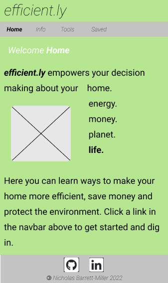
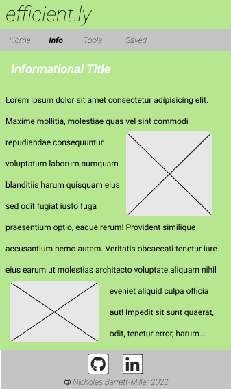
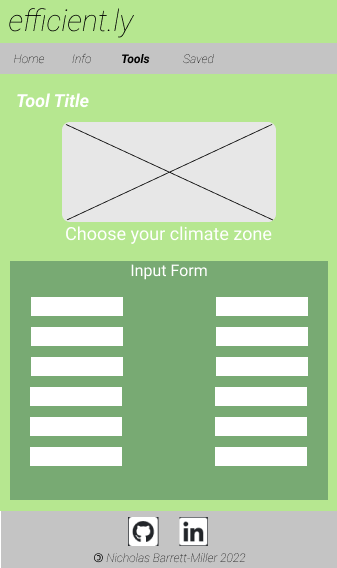
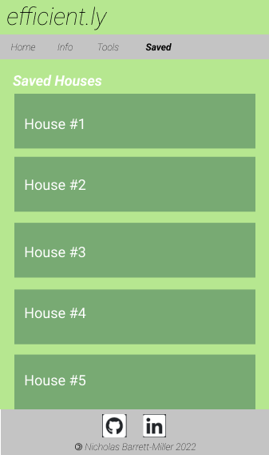
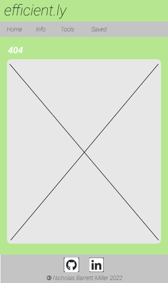
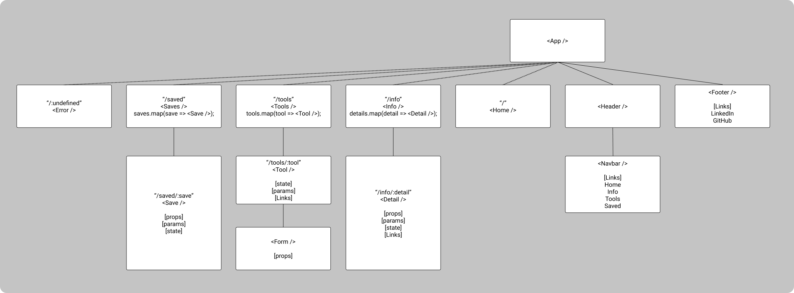

# **_efficient.ly_**

## Overview

**_efficient.ly_** is a [React](https://reactjs.org/) application that empowers users to make informed decisions about energy and resource usage in their homes. The site contains a plethora of information on ways to make their homes more efficient and therefore, save money and protect the environment.

## Wireframes
#### Homepage


#### Informational Page


#### Tool Page


#### Saved Page


#### 404 Error Page


###### [Wireframes created with Figma](https://www.figma.com/)

## Component Hierarchy

###### [Component hierarchy created with Figma](https://www.figma.com/)

## API and Data Sample

This project uses [Airtable](https://www.airtable.com/) as an API. The response data from Airtable returns an object with data specifying insulation and heating energy data for a house in a given U.S. climate zone:

```
{
    "id": "recr5WqMFpDchrkXw",
    "fields": {
        "houseWidth": 20,
        "houseLength": 40,
        "exteriorRoofInsulationThickness": 0,
        "windowLength": 3,
        "joistWidth": 1.5,
        "storyNum": 2,
        "rafterWidth": 1.5,
        "joistDepth": 5.5,
        "windowNum": 10,
        "studSpacing": 16,
        "climateZone": 3,
        "insulationRValue": 4,
        "roofPitch": 45,
        "joistSpacing": 16,
        "btuPerHr": 0,
        "interiorWallInsulationThickness": 0,
        "studWidth": 1.5,
        "windowWidth": 2,
        "interiorRoofInsulationThickness": 0,
        "studDepth": 3.5,
        "rafterSpacing": 48,
        "exteriorWallInsulationThickness": 0,
        "framingRValue": 0.91,
        "storyHeight": 14,
        "rafterDepth": 11.25,
        "indoorTempNight": 62,
        "windowRValue": 3
    },
    "createdTime": "2022-01-08T01:12:28.000Z"
}
```
###### Uses [React Router](https://reactrouter.com/docs/en/v6) for routes and [Axios](https://axios-http.com/docs/intro) for API requests.

## MVP/PostMVP
#### MVP
- Uses [Airtable](https://www.airtable.com/) base as API
- Contains information on heating, cooling, and ventilation as they pertain to green building design
- Renders heating data to page, and based on user input sizes heating load requirements and saves to database
- Uses [Flexbox](https://css-tricks.com/snippets/css/a-guide-to-flexbox/) styling and responsive design on two different screen sizes
- Displays header with title of site, navbar, and footer with links to gitHub and [LinkedIn](www.linkedin.com/in/ndbmiller)

#### PostMVP
- Utilize GIS data from [ESRI](https://developers.arcgis.com/javascript/latest/) to make clickable map for climate zone data
- Information on electrical, and water
- Tools for ventilation, electrical, cooling, and water
- Save various categories of data to different "houses" that will be displayed as interactive list
- Make the houses editable
- Interactive graphs displaying cost savings based on local utility data
- Darkmode

## Project Schedule

|  Day | Deliverable | Status
|---|---| ---|
|Jan 7-9| Prompt / Wireframes / Component Hierarchy / Timeframes | Complete
|Jan 10| Project Approval / Header and Footer / Homepage / 404 Page | Complete
|Jan 11| Tool Page | Complete
|Jan 12| Tool Page / Saved Houses Page| Complete
|Jan 13| Informational Pages / CSS Framework| Complete
|Jan 14| CSS Polish | Complete
|Jan 15| Post MVP | Complete
|Jan 16| Post MVP | Complete
|Jan 17| Post MVP | Complete
|Jan 18| Presentation | Complete

## Timeframes

| Component | Priority  | Estimated Time    | Curently Invested | Actual Time   |
| ---       | :---:     |  :---:            | :---:         | :---:         |
| Airtable Setup | H    | 1hrs              | 0 hrs         | X hrs         |
| Header | M    | 2hrs              | 2 hrs         | 2 hrs         |
| Footer | L    | 1hrs              | 1 hrs         | 1 hrs         |
| Homepage | H    | 2hrs              | 2 hrs         | 2 hrs         |
| Info Page | H    | 3hrs              | 2 hrs         | 2 hrs         |
| Info Page Details | H    | 3hrs              | 3 hrs         | 3 hrs         |
| Error Page | M    | 2hrs              | 1 hrs         | 1 hrs         |
| Heat Sizing Tool Page | H    | 3hrs              | 5 hrs         | 5 hrs         |
| Heat Sizing Tool JS Logic | H    | 3hrs              | 3 hrs         | 3 hrs         |
| Category Specific Airtables | H    | 3hrs              | 2 hrs         | 2 hrs         |
| Saved House Page | H    | 3hrs              | 3 hrs         | 3 hrs         |
| Saved House Airtable | H    | 3hrs              | 2 hrs         | 2 hrs         |
| CSS Framework Setup | H    | 3hrs              | 5 hrs         | 5 hrs         |
| CSS Polish | M    | 4hrs              | 10 hrs         | 4 hrs         |
| Darkmode | L    | 2hrs              | 0 hrs         | X hrs         |
| Interactive Graphs | L    | 3hrs              | 0 hrs         | X hrs         |
| Total     |           | 41hrs             | 40hrs          | 40hrs        |

## SWOT Analysis
### Strengths
> I have a plethora of knowledge on green building design and I have a great understanding of the content that will populate **_efficient.ly_**. The setup of the website will be fast.

### Weaknesses
> This will be my first time implementing a CSS framework which means it will likely take more time getting setup. However, it will be a powerful and worthwile tool for making a consistent theme throughout the application.

### Opportunities
> This project is an oportunity to see how far I can push React while on a time budget. My main goal is to make a professional and fully featured functional site with free tools that people will get a lot of value out of.

### Threats
> I will need to be careful to manage the complexity of this application, as there are many components that will be resused for different subject matters. Keeping the complexity of individual components low and keeping data passed down consistent will mitigate this.

## Code Snippet

## [Change Log](https://github.com/nickdbmiller/efficient.ly/commits/main)
